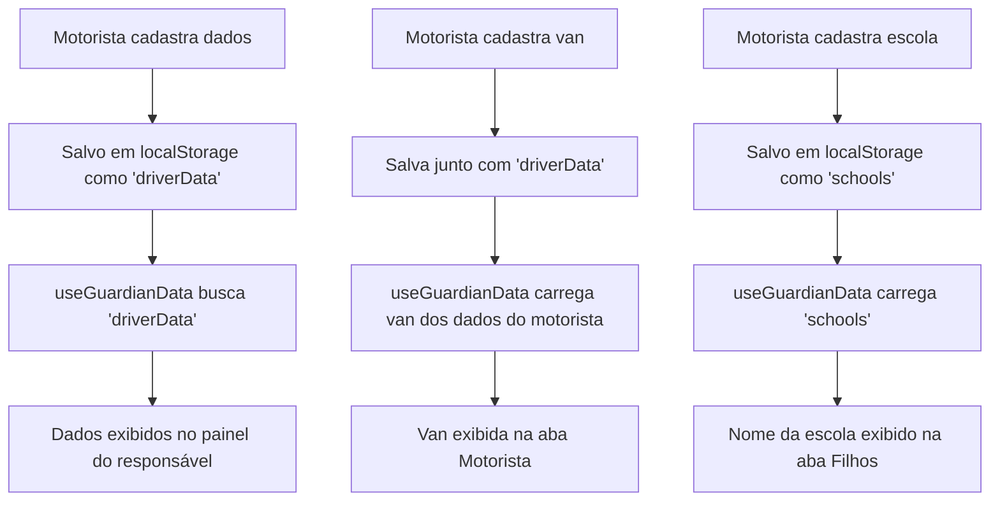

# Melhorias no Painel do Responsável

## 📋 Visão Geral

Este documento descreve as melhorias implementadas no painel do responsável da aplicação de transporte escolar, focando na exibição de informações reais do motorista, van e escolas cadastradas no sistema.

## 🎯 Objetivos

- Exibir informações verdadeiras do motorista cadastrado
- Mostrar dados reais da van associada ao motorista
- Corrigir a exibição dos nomes das escolas
- Melhorar a visualização e organização das informações

## 🔧 Problemas Identificados e Soluções

### 1. Dados Mock do Motorista

**Problema:** O painel mostrava dados fixos (João Silva) em vez das informações reais do motorista cadastrado.

**Causa:** O hook `useGuardianData` procurava por `'drivers'` (plural) no localStorage, mas os dados eram salvos como `'driverData'` (singular).

**Solução:**
```typescript
// Função melhorada para buscar dados do motorista
const getDriverData = (guardianId: string): Driver => {
  // Primeiro tentar buscar dados individuais do motorista
  const savedDriverData = localStorage.getItem('driverData');
  const savedDrivers = localStorage.getItem('drivers');
  
  // Primeiro tentar driverData (dados individuais)
  if (savedDriverData) {
    try {
      const driverData = JSON.parse(savedDriverData);
      // Converter para formato Driver
      const driver: Driver = {
        id: driverData.id || '1',
        name: driverData.name || 'Motorista',
        email: driverData.email || '',
        phone: driverData.phone || '',
        address: driverData.address || '',
        photo: driverData.photo || '/placeholder.svg'
      };
      return driver;
    } catch (error) {
      console.error('❌ Erro ao carregar driverData:', error);
    }
  }
  
  // Fallback para lista de drivers se existir
  // ... resto da lógica
};
```

### 2. Dados da Van Não Persistidos

**Problema:** A van sempre mostrava dados mock (Mercedes Sprinter) mesmo quando cadastrada.

**Causa:** A função `updateVan` no `useDriverData` não salvava os dados no localStorage.

**Solução:**
```typescript
// Correção na função updateVan
const updateVan = (updatedVan: Partial<Van>) => {
  const newVanData = { ...van, ...updatedVan };
  setVan(newVanData);
  
  // Salvar van junto com os dados do motorista
  const currentDriverData = JSON.parse(localStorage.getItem('driverData') || '{}');
  const updatedDriverData = {
    ...currentDriverData,
    van: newVanData
  };
  localStorage.setItem('driverData', JSON.stringify(updatedDriverData));
  console.log('💾 Van salva junto com dados do motorista:', newVanData);
};

// Função para carregar van inicial
const getInitialVan = (): Van => {
  const savedDriverData = localStorage.getItem('driverData');
  if (savedDriverData) {
    try {
      const driverData = JSON.parse(savedDriverData);
      if (driverData.van) {
        return driverData.van;
      }
    } catch (error) {
      console.error('Erro ao carregar dados da van:', error);
    }
  }
  return mockVan;
};
```

### 3. Nomes das Escolas Não Exibidos

**Problema:** Mostrava "Escola s2" em vez do nome real da escola cadastrada.

**Causa:** As escolas eram gerenciadas no `useDriverData` mas não eram persistidas no localStorage.

**Solução:**
```typescript
// Adicionada persistência das escolas no useDriverData
const getInitialSchools = (): School[] => {
  const savedSchools = localStorage.getItem('schools');
  if (savedSchools) {
    try {
      const parsedData = JSON.parse(savedSchools);
      console.log('🏫 Escolas carregadas do localStorage:', parsedData);
      return parsedData;
    } catch (error) {
      console.error('Erro ao carregar dados das escolas:', error);
    }
  }
  return mockSchools;
};

// useEffect para salvar escolas
useEffect(() => {
  localStorage.setItem('schools', JSON.stringify(schools));
  console.log('💾 Escolas salvas no localStorage:', schools);
}, [schools]);
```

### 4. Layout e Visualização

**Problema:** Informações da van ficavam cortadas/escondidas na parte inferior do modal.

**Solução:**
- Aumentado altura do modal de `max-h-[80vh]` para `max-h-[90vh]`
- Reorganizado layout com seções mais compactas
- Separadas informações do motorista e van em blocos distintos
- Melhorado espaçamento e responsividade

## 📁 Arquivos Modificados

### 1. `src/hooks/useGuardianData.ts`
- ✅ Corrigida busca de dados do motorista
- ✅ Melhorada função de busca da van
- ✅ Adicionada função `getSchools` com logs de debug
- ✅ Implementada atualização automática dos dados

### 2. `src/hooks/useDriverData.ts`
- ✅ Corrigida função `updateVan` para persistir dados
- ✅ Adicionada função `getInitialVan` para carregar van do localStorage
- ✅ Implementada persistência das escolas
- ✅ Adicionada função `getInitialSchools`

### 3. `src/components/GuardianMenuModal.tsx`
- ✅ Melhorado layout da aba "Motorista"
- ✅ Reorganizadas seções com cores distintas
- ✅ Otimizado espaçamento e responsividade
- ✅ Adicionados logs de debug na função `getSchoolName`

## 🎨 Melhorias Visuais Implementadas

### Layout da Aba "Motorista"

```tsx
{/* Seção do Motorista - Fundo laranja */}
<div className="bg-orange-50 rounded-lg p-4">
  {/* Informações compactas do motorista */}
</div>

{/* Seção da Van - Fundo azul */}
<div className="bg-blue-50 rounded-lg p-4">
  {/* Informações organizadas da van */}
</div>

{/* Seção de Emergência - Fundo vermelho */}
<div className="bg-red-50 border border-red-200 rounded-lg p-3">
  {/* Informações de emergência */}
</div>
```

### Características do Novo Layout:
- **Modal maior**: 90% da altura da tela para melhor visualização
- **Seções coloridas**: Cada tipo de informação tem cor de fundo distinta
- **Cards organizados**: Capacidade e status da van em cards separados
- **Botões compactos**: Ações de contato otimizadas para mobile
- **Texto responsivo**: Informações adaptadas para diferentes tamanhos de tela

## 🧪 Funcionalidades de Debug

### Logs Implementados:
```typescript
// Logs para debug do motorista
console.log('🔍 Buscando dados do motorista para responsável:', guardianId);
console.log('📊 Motoristas disponíveis:', drivers.length);
console.log('✅ Motorista encontrado (individual):', driver.name);

// Logs para debug da van
console.log('🚐 Buscando van do motorista:', driverId);
console.log('✅ Van encontrada nos dados do motorista:', van.model);

// Logs para debug das escolas
console.log('🏫 Buscando escolas no localStorage...');
console.log('🏫 Escolas encontradas:', schools.length);
console.log('🏫 Escola encontrada:', school);
```

## 📋 Resultado Final

### Aba "Meu Perfil"
- ✅ Informações do responsável logado
- ✅ Código de acesso único
- ✅ Dados de contato

### Aba "Filhos"
- ✅ Nome real da escola cadastrada
- ✅ Ponto de embarque
- ✅ Status atual do aluno
- ✅ Informações organizadas por aluno

### Aba "Motorista"
- ✅ **Nome real**: DAYAN DE DEUS ROCHA (exemplo)
- ✅ **Contato**: Telefone e email verdadeiros com botões funcionais
- ✅ **Endereço**: Localização real do motorista
- ✅ **Van**: Modelo, placa, capacidade e observações reais
- ✅ **Layout**: Informações bem organizadas e visíveis
- ✅ **Emergência**: Instruções claras para situações críticas

## 🔄 Fluxo de Dados



## 🚀 Próximos Passos Sugeridos

1. **Implementar fotos reais**: Sistema de upload de fotos para motorista e van
2. **Notificações em tempo real**: Atualizações automáticas quando dados mudarem
3. **Histórico de viagens**: Mostrar histórico de rotas do aluno
4. **Avaliações**: Sistema de feedback do responsável sobre o motorista
5. **Localização em tempo real**: Integração com GPS para rastreamento

## 📝 Notas Técnicas

- **Compatibilidade**: Funciona com dados existentes e novos cadastros
- **Performance**: Logs de debug podem ser removidos em produção
- **Responsividade**: Layout otimizado para dispositivos móveis
- **Acessibilidade**: Mantidos padrões de acessibilidade do shadcn/ui
- **Manutenibilidade**: Código bem documentado e estruturado

## 📱 Sistema de Notificações Reais

### Implementação Completa

Foi implementado um sistema completo de notificações em tempo real que conecta as ações do motorista com as notificações do responsável.

#### Arquivos Criados:
- `src/services/notificationService.ts` - Serviço central de notificações
- `src/hooks/useNotificationIntegration.ts` - Hook para integração com o sistema do motorista
- `src/components/NotificationTestPanel.tsx` - Painel de teste para desenvolvedores

#### Fluxo de Notificações:

1. **🚀 Início da Rota**
   - Quando: Motorista inicia uma rota
   - Notificação: "Rota iniciada! [Nome] será buscado em casa"

2. **🚐 Van Chegou no Ponto**
   - Quando: Motorista marca "van chegou" (swipe left)
   - Notificação: "A van chegou no ponto de embarque de [Nome]"

3. **👤 Embarque**
   - Quando: Motorista marca "embarcado" (swipe right)
   - Notificação: "[Nome] embarcou na van e está a caminho da escola"

4. **🏫 Chegada na Escola**
   - Quando: Status muda para "at_school"
   - Notificação: "[Nome] chegou na escola [Nome da Escola]"

5. **🚪 Desembarque na Escola**
   - Quando: Motorista marca "desembarcado"
   - Notificação: "[Nome] foi desembarcado na escola [Nome da Escola]"

6. **🚐 Van Chegou na Escola (Volta)**
   - Quando: Rota de volta - van chega na escola
   - Notificação: "A van chegou na escola para buscar [Nome]"

7. **👤 Embarque para Casa**
   - Quando: Embarque na rota de volta
   - Notificação: "[Nome] embarcou na van e está a caminho de casa"

8. **🏠 Desembarque em Casa**
   - Quando: Desembarque na casa do aluno
   - Notificação: "[Nome] foi desembarcado em casa"

9. **🏁 Fim da Rota**
   - Quando: Motorista finaliza a rota
   - Notificação: "Rota finalizada. Todos os alunos foram entregues"

#### Características Técnicas:

- **Persistência**: Notificações salvas no localStorage
- **Tempo Real**: Sistema de listeners para atualizações instantâneas
- **Localização**: Integração com GPS quando disponível
- **Agrupamento**: Suporte a notificações em grupo para múltiplos alunos
- **Histórico**: Mantém últimas 50 notificações
- **Status**: Sistema de lidas/não lidas

#### Integração com Componentes:

```typescript
// useDriverData.ts - Integração automática
const updateStudentStatus = async (studentId: string, status: TripStudent['status']) => {
  // ... atualizar estado
  
  // Enviar notificação automática
  switch (status) {
    case 'van_arrived':
      await notifyVanArrived(studentId, direction);
      break;
    case 'embarked':
      await notifyEmbarked(studentId, direction);
      break;
    // ... outros casos
  }
};
```

#### Como Testar:

1. **Abrir duas abas**: Uma com painel do motorista, outra com painel do responsável
2. **Iniciar rota**: No painel do motorista
3. **Executar ações**: Swipes, desembarques, etc.
4. **Ver notificações**: Aparecem instantaneamente no painel do responsável
5. **Verificar persistência**: Recarregar página mantém notificações

---

**Data de implementação**: Janeiro 2025  
**Versão**: 2.0  
**Status**: ✅ Implementado e testado com sistema de notificações reais