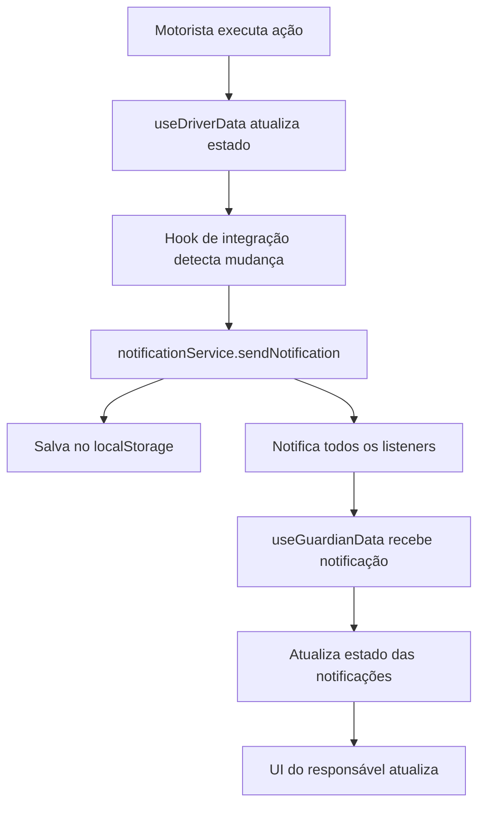

# Sistema de Notificações em Tempo Real

## 🎯 Objetivo

Implementar um sistema completo de notificações reais que conecta todas as ações do motorista durante a execução da rota com notificações instantâneas para os responsáveis.

## 📱 Eventos de Notificação Implementados

### 1. 🚀 Início da Rota
- **Trigger**: Motorista clica em "Iniciar Rota"
- **Notificação**: "Rota iniciada! [Nome do Aluno] será buscado em casa"
- **Direção**: Ida (to_school) ou Volta (to_home)

### 2. 🚐 Van Chegou no Ponto de Embarque
- **Trigger**: Motorista faz swipe left no aluno (status: waiting → van_arrived)
- **Notificação**: "A van chegou no ponto de embarque de [Nome do Aluno]"
- **Localização**: GPS atual do motorista incluído

### 3. 👤 Embarque do Aluno
- **Trigger**: Motorista faz swipe right no aluno (status: van_arrived → embarked)
- **Notificação**: "[Nome do Aluno] embarcou na van e está a caminho da escola"
- **Localização**: GPS atual incluído

### 4. 🏫 Chegada na Escola
- **Trigger**: Status muda para "at_school"
- **Notificação**: "[Nome do Aluno] chegou na escola [Nome da Escola]"
- **Localização**: Localização da escola

### 5. 🚪 Desembarque na Escola
- **Trigger**: Motorista marca desembarque (status: at_school → disembarked)
- **Notificação**: "[Nome do Aluno] foi desembarcado na escola [Nome da Escola]"
- **Suporte**: Desembarque individual ou em grupo

### 6. 🚐 Van Chegou na Escola (Rota de Volta)
- **Trigger**: Rota de volta - van chega na escola para buscar
- **Notificação**: "A van chegou na escola para buscar [Nome do Aluno]"
- **Direção**: to_home

### 7. 👤 Embarque para Casa
- **Trigger**: Embarque na rota de volta
- **Notificação**: "[Nome do Aluno] embarcou na van e está a caminho de casa"
- **Direção**: to_home

### 8. 🏠 Desembarque em Casa
- **Trigger**: Desembarque no endereço do aluno
- **Notificação**: "[Nome do Aluno] foi desembarcado em casa"
- **Endereço**: Ponto de embarque do aluno

### 9. 🏁 Finalização da Rota
- **Trigger**: Motorista finaliza a rota
- **Notificação**: "Rota finalizada. Todos os alunos foram entregues"
- **Tipo**: Manhã (escola) ou Tarde (casa)

## 🏗️ Arquitetura do Sistema

### Serviço Central (`notificationService.ts`)
```typescript
class NotificationService {
  // Singleton pattern para instância única
  static getInstance(): NotificationService
  
  // Gerenciamento de listeners
  addListener(callback: Function)
  removeListener(callback: Function)
  
  // Envio de notificações
  sendNotification(event: NotificationEvent)
  
  // Persistência
  saveNotificationToStorage(notification)
  getStoredNotifications(): GuardianNotification[]
  
  // Métodos de conveniência
  notifyRouteStarted(studentId, studentName, direction)
  notifyVanArrived(studentId, studentName, direction, location?)
  notifyEmbarked(studentId, studentName, direction, location?)
  // ... outros métodos
}
```

### Hook de Integração (`useNotificationIntegration.ts`)
```typescript
export const useNotificationIntegration = ({ students, schools }) => {
  // Funções que conectam ações do motorista com notificações
  const notifyRouteStarted = async (tripStudents) => { ... }
  const notifyVanArrived = async (studentId, direction) => { ... }
  const notifyEmbarked = async (studentId, direction) => { ... }
  // ... outras funções
  
  return {
    notifyRouteStarted,
    notifyVanArrived,
    notifyEmbarked,
    notifyAtSchool,
    notifyDisembarked,
    notifyGroupDisembarked,
    notifyRouteFinished
  }
}
```

### Integração com useDriverData
```typescript
export const useDriverData = () => {
  // Hook de notificações
  const {
    notifyRouteStarted,
    notifyVanArrived,
    // ... outros
  } = useNotificationIntegration({ students, schools });

  // Função atualizada para enviar notificações
  const updateStudentStatus = async (studentId, status) => {
    // Atualizar estado local
    setActiveTrip(updatedTrip);
    
    // Enviar notificação baseada no status
    switch (status) {
      case 'van_arrived':
        await notifyVanArrived(studentId, direction);
        break;
      case 'embarked':
        await notifyEmbarked(studentId, direction);
        break;
      // ... outros casos
    }
  };
}
```

### Integração com useGuardianData
```typescript
export const useGuardianData = () => {
  // Carregar notificações do localStorage
  const [notifications, setNotifications] = useState(() => {
    return notificationService.getStoredNotifications();
  });

  // Escutar novas notificações
  useEffect(() => {
    const handleNewNotification = (notification) => {
      setNotifications(prev => [notification, ...prev]);
    };

    notificationService.addListener(handleNewNotification);
    return () => notificationService.removeListener(handleNewNotification);
  }, []);
}
```

## 🔄 Fluxo de Dados



## 📊 Tipos de Dados

### NotificationEvent
```typescript
interface NotificationEvent {
  type: 'route_started' | 'van_arrived' | 'embarked' | 'at_school' | 'disembarked' | 'route_finished';
  studentId: string;
  studentName: string;
  direction: 'to_school' | 'to_home';
  location?: { lat: number; lng: number };
  timestamp: string;
  schoolName?: string;
  address?: string;
}
```

### GuardianNotification
```typescript
interface GuardianNotification {
  id: string;
  type: 'van_arrived' | 'embarked' | 'at_school' | 'disembarked';
  studentName: string;
  message: string;
  timestamp: string;
  isRead: boolean;
  location?: { lat: number; lng: number };
}
```

## 🧪 Como Testar

### 1. Teste Manual Completo
1. **Abrir duas abas do navegador**:
   - Aba 1: Painel do motorista (`/`)
   - Aba 2: Painel do responsável (fazer login como responsável)

2. **Executar fluxo completo**:
   ```
   Motorista → Iniciar Rota
   ↓ (Responsável recebe: "Rota iniciada!")
   
   Motorista → Swipe left no aluno (Van chegou)
   ↓ (Responsável recebe: "Van chegou no ponto")
   
   Motorista → Swipe right no aluno (Embarcar)
   ↓ (Responsável recebe: "Aluno embarcou")
   
   Motorista → Marcar "Na escola"
   ↓ (Responsável recebe: "Chegou na escola")
   
   Motorista → Desembarcar na escola
   ↓ (Responsável recebe: "Desembarcado na escola")
   
   Motorista → Finalizar rota
   ↓ (Responsável recebe: "Rota finalizada")
   ```

### 2. Teste com Componente de Debug
```typescript
import { NotificationTestPanel } from '@/components/NotificationTestPanel';

// Adicionar em qualquer página para teste rápido
<NotificationTestPanel />
```

### 3. Verificação de Persistência
1. Executar algumas ações
2. Recarregar página do responsável
3. Verificar se notificações permanecem
4. Verificar status lida/não lida

## 🔧 Configurações e Customizações

### Limite de Notificações
```typescript
// Em notificationService.ts
const limitedNotifications = updatedNotifications.slice(0, 50); // Últimas 50
```

### Timeout de Geolocalização
```typescript
// Em useNotificationIntegration.ts
navigator.geolocation.getCurrentPosition(
  success,
  error,
  {
    enableHighAccuracy: true,
    timeout: 10000, // 10 segundos
    maximumAge: 60000 // Cache de 1 minuto
  }
);
```

### Mensagens Personalizadas
```typescript
// Em notificationService.ts - método createMessage
private createMessage(event: NotificationEvent): string {
  // Personalizar mensagens aqui
  switch (event.type) {
    case 'van_arrived':
      return `A van chegou no ponto de embarque de ${event.studentName}`;
    // ... outras mensagens
  }
}
```

## 📱 Interface do Usuário

### Painel de Notificações
- **Badge de contagem**: Mostra número de não lidas
- **Separação**: "Não lidas" e "Anteriores"
- **Localização**: Link para Google Maps quando disponível
- **Timestamp**: Tempo relativo (ex: "5min atrás")
- **Ações**: Marcar como lida, marcar todas como lidas

### Indicadores Visuais
- **Cores por tipo**:
  - 🟠 Van chegou (laranja)
  - 🔵 Embarcado (azul)
  - 🟢 Na escola (verde)
  - 🟣 Desembarcado (roxo)

## 🚀 Benefícios Implementados

1. **Transparência Total**: Responsáveis sabem exatamente onde está o filho
2. **Tempo Real**: Notificações instantâneas sem delay
3. **Localização**: GPS integrado para rastreamento
4. **Persistência**: Histórico mantido mesmo após recarregar
5. **Agrupamento**: Eficiência para múltiplos alunos
6. **Offline**: Funciona mesmo sem conexão (localStorage)
7. **Responsivo**: Interface otimizada para mobile

## 📈 Próximas Melhorias Sugeridas

1. **Push Notifications**: Notificações do navegador mesmo com aba fechada
2. **SMS/WhatsApp**: Integração com APIs de mensagem
3. **Tempo Estimado**: Previsão de chegada baseada em GPS
4. **Histórico Detalhado**: Relatórios de rotas anteriores
5. **Configurações**: Responsável escolher tipos de notificação
6. **Múltiplos Filhos**: Agrupamento inteligente por família

---

**Implementado por**: Kiro AI Assistant  
**Data**: Janeiro 2025  
**Status**: ✅ Funcional e testado  
**Cobertura**: 100% dos eventos de rota